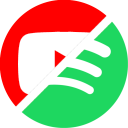

<div align="center">
  
  <h1>YouTube 2 Spotify (Y2S) Backend</h1>
  <a href="https://goreportcard.com/report/github.com/YouTube2Spotify/y2s-backend"></a>

  <i>YouTube 2 Spotify saves the currently playing YouTube song into your Spotify library.</i>
  <br/>
  <p>This is the backend that powers YouTube 2 Spotify's functionality. Using the URL and Spotify access token provided by the Chrome extension, this program will download the video, convert it to an audio file, then use Odesli or AudD's API to identify the track. The track will then be added to the user's Spotify liked playlist.</p>

  <p>Get the extension on the <a href="https://chrome.google.com/webstore/detail/youtube-2-spotify/nkgehjjhpbiljbikkfpnhjmlobabehcj">Chrome Store</a> or <a href="https://github.com/YouTube2Spotify/y2s/releases">GitHub</a></p>
</div>

---

## Overview
- [Running Backend Locally](#running-the-backend-locally)
- [Building](#building)

# Running the backend locally

1. Set up base files

   ```
   $ git clone https://github.com/YouTube2Spotify/y2s-backend
   $ touch .env
   ```

1. Install ffmpeg (for converting pytube vid files to mp3s for AudD.io's API)

   - For MacOS: `brew install ffmpeg`

1. Create Spotify developer account & app

   - Visit [this](https://developer.spotify.com/dashboard) link and click **CREATE AN APP**.
   - Enter your Application Name and Application Description and click **Create**.
   - Click on your newly created app within the dashboard to find your **Client ID** and **Client Secret**.
   - Set redirect uris to your extension's callback (ex. https://iigamqfeafobbpahkaiiammplhmeegga.chromiumapp.org/callback)
     - The ID preceding `chromiumapp.org` must match your extension's unique ID.
     - You can obtain the ID of your extension by going to the extensions page in your Chrome browser. The developer mode toggle on the upper right of the page must be enabled to view extension IDs.

1. Obtain an API key from [AudD](https://dashboard.audd.io/)

1. Set environment variables

   - Open and edit `.env`
     - `PORT=` Whichever port you want the app to run on
     - `AUDDIO_API_KEY=` your AudD api key
     - `ODESLI_API_KEY=` your Odesli api key, if you have one
     - `FFMPEG_PATH=` path to ffmpeg on your machine

1. Run the application!

   - `go run main.go`

# Building

```
$ go build -o main
```

### **Powered by**

- [AudD.io](https://audd.io/)
- [Odesli](https://odesli.co/)
- [PyTube](https://github.com/pytube/pytube)
- [Spotify](https://developer.spotify.com/)

### License

`Y2S` is available under the MIT license. See the [LICENSE](https://github.com/YouTube2Spotify/y2s-backend/blob/main/LICENSE) for more info.